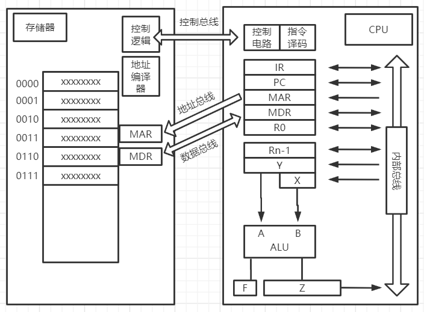

# 计算机组成
## 计算机的兴起
+ 存储程序
+ EDVAC 冯·诺依曼结构
+ UNVAC 开启商用计算机时代
## 冯·诺依曼结构
| 冯·诺依曼结构             | 现代计算机             |
|---------------------------|------------------------|
| 运算器CA和控制器CC，合称C | CPU                    |
| 存储器M                   | 主存储器（主存，内存） |
+ C：Central CPU：Central Processing Unit
+ CPU <- 系统总线 -> 主存储器
### 主存的组成形式
+ 地址
+ 内容
### 冯·诺依曼结构的运转
 
#### 存储器
+ 存储单元的地址是唯一的
+ 存储单元的位宽由设计计算机时对存储器的编址方法确定。如果存储器按字节编址，则每个存储单元存放8位二进制数 
+ MAR：存储器地址寄存器 Memory Address Register 用于存放CPU正在读或写的存储单元的地址
+ MDR：存储器数据寄存器 Memory Data Register 用于存放CPU正在读出或即将写入存储单元的数据
+ 系统总线
	+ 控制总线：读、写、完成等控制信号
	+ 地址总线：如果地址总线宽度位n，则CPU能管理的存储单元最多位2^n个
	+ 数据总线：数据总线宽度一般位存储单元位宽的整数倍
#### 控制器
1. IR存放 "正在执行或者即将执行的指令"
2. PC存放 "下一条指令的存储单元地址"，具有自动增量计数的功能
3. MAR在访存时用于存放 "存储单元的地址"
4. MDR在访存时用于存放 "对存储单元读/写的数据"
5. 指令译码部件对IR中的指令进行译码，以确定IR中存放的时哪一条指令
6. 控制电路产生控制信号，在时序脉冲的同步下控制各个部件的动作 
        **注** 
IR：指令寄存器 Instruction Register 
PC：Program Counter
#### 运算器
### 计算机执行指令的流程
略，稍后补充流程图
### 经典南北桥结构的演化
#### （一）
